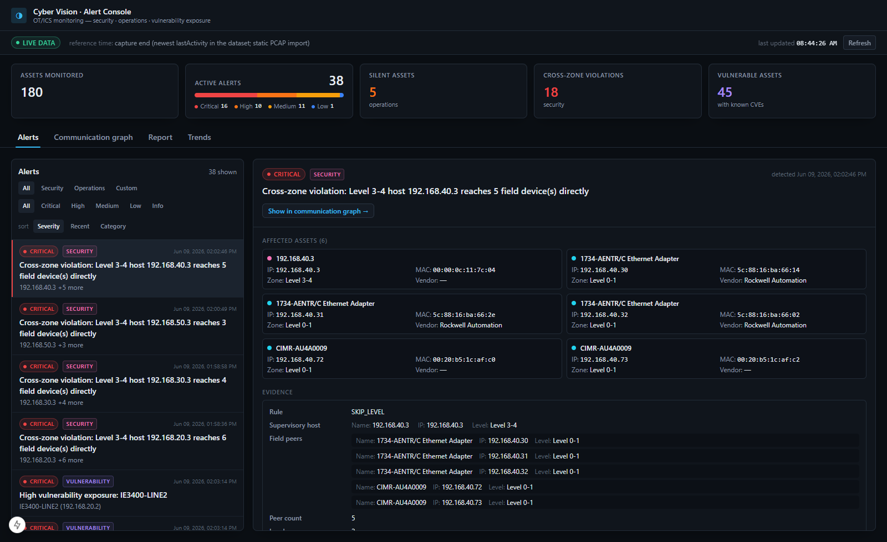
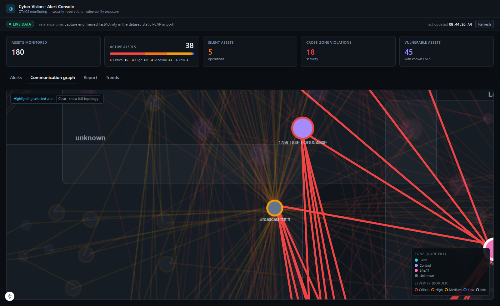
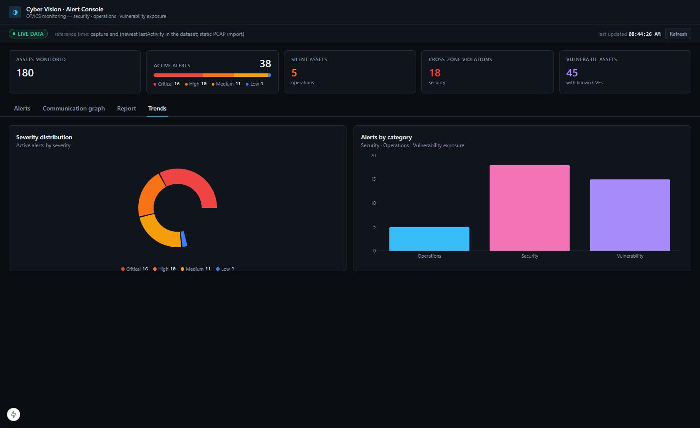

# Cisco Cyber Vision — OT Alert Console (Dashboard)

> The **dashboard UI** for a Cisco Cyber Vision alert experience: a severity-ranked **Alerts** console,
> a Purdue-layered **communication graph** with alert blast-radius highlighting, a sortable **Report**,
> and **KPI + Trends** charts. Built for an OT SOC analyst triaging an industrial network.
> Next.js · TypeScript · Tailwind · Cytoscape · Recharts.

**▶ Live:** https://cv-alerts-frontend.vercel.app  ·  **API it talks to:** https://cv-alerts-backend-1.onrender.com

> ⏳ **First load takes ~30–60s** while the free-tier backend wakes from idle — the UI shows a
> **"Waking the backend…"** state and recovers automatically (not a failure). The badge top-left reads
> **"Snapshot"** because the public demo's backend runs on frozen sample data, never a live Center.



---

## What's in it

| View | What it does |
|---|---|
| **KPI strip** | Assets monitored, active alerts with a severity-segmented bar, silent / cross-zone / vulnerable counts |
| **Alerts** (centerpiece) | Filter (category, severity) + sort; click a row → detail panel with readable **evidence**, **rationale**, **compliance reference**, **recommended action**, and the full affected-asset list |
| **Communication graph** | Cytoscape topology grouped into the 4 Purdue zones; **selecting an alert highlights exactly the implicated nodes/edges and dims the rest**; hover tooltips; zone + severity legend |
| **Report** | Every alert as a sortable table with **Copy-as-CSV** and **print** |
| **Trends** | Severity-distribution donut + alerts-by-category bar (Recharts) |

| Alert → graph blast radius | Report + Trends |
|---|---|
|  |  |

**Always-on states:** loading skeletons, an explicit empty state, a backend-unreachable error state,
and the Render cold-start "waking up" state with retry/backoff. Polls every 20s with a "last updated"
stamp and a truthful **live / snapshot** badge.

---

## 🔒 Security posture

- **Thin client by design.** The dashboard talks **only** to our backend (`NEXT_PUBLIC_API_BASE_URL`)
  and has **no path to the Cyber Vision Center** — the CV token stays server-side and never touches the
  browser.
- **No secrets in this repo.** The only configured value is the public backend URL (not a secret);
  `.env.local` is gitignored. History is clean.

---

## Run locally (from a fresh clone)

Node 18+ (developed on Node 24). A backend must be reachable — local or the live URL above.

```bash
npm install
echo "NEXT_PUBLIC_API_BASE_URL=http://localhost:8000" > .env.local   # or the live Render URL
npm run dev            # → http://localhost:3000
# production: npm run build && npm run start
```

`npm run build` type-checks and lints the whole app.

## How it's wired

- `lib/types.ts` mirrors the backend Pydantic models; `lib/api.ts` is the single typed fetch boundary.
- `lib/tokens.ts` defines severity + zone colors **once** (used by chips, KPI segments, graph, charts).
- `lib/useDashboardData.ts` polls, stamps "last updated", and drives loading / empty / error / waking states.
- Selecting an alert sets a shared id; `components/GraphCanvas.tsx` highlights the nodes/edges whose
  `alert_ids` include it.

---

## System of record
All design docs, the alert engine, API findings, and the alert spec live in the backend repo:
**👉 https://github.com/pyhrishi/cv-alerts-backend** (start at [`docs/SUBMISSION.md`](https://github.com/pyhrishi/cv-alerts-backend/blob/master/docs/SUBMISSION.md)).
